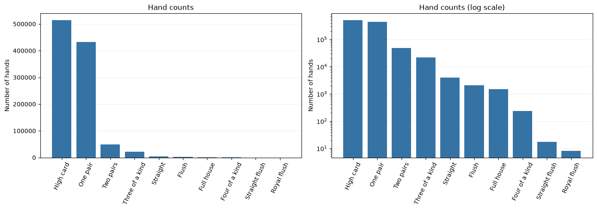

# Poker Hand Classification

> This reading copy is displayed directly on GitHub. You can also [download the original HTML report](https://github.com/frangu617/FinalProject/raw/refs/heads/master/poker_hand_analysis_group_reading.html?download=1) and open it in your browser. Download and website setup instructions follow the report.

**AAI 500 - Group discussion draft - September 27, 2026**<br>
**Team and contributors:** To be added by the group

## Current progress

The notebook loads the local dataset, previews the features, checks dimensions and missing values, and summarizes hand categories. **No models have been trained or evaluated yet.** The proposed modeling and evaluation sections are discussion points for the team.

**Initial findings:** The combined files contain 1,025,010 hands, ten input features, and one target. There are no missing values. High-card hands and one-pair hands dominate the dataset; only eight records are royal flushes. These counts describe the combined files, not model performance.

## 1. Introduction

This project explores how classification models identify five-card poker hands from each card's suit and rank.

**Proposed research question:** How accurately can classification models identify poker hands, and how does performance differ between common and rare categories?

The group should confirm the research question and course requirements before choosing models. Poker categories follow fixed rules, so the final discussion should explain what we learn from a statistical classifier and how it compares with a rule-based evaluator.

**Data source:** Cattral, R., & Oppacher, F. (2002). *Poker Hand*. UCI Machine Learning Repository. DOI: 10.24432/C5KW38.

### Course requirements guiding this draft

This project must demonstrate an end-to-end statistical analysis and explain the validity of the selected model. The six main analysis sections below follow the required report structure. Sections 7-10 are planning notes for our group, not completed report findings.

**Rubric priorities:** Technical report: 50% (90 points); Python code: 30% (54 points); team presentation: 20% (36 points), for 180 points total. Clear interpretation, appropriate methods, assumptions, limitations, and reproducible code matter alongside predictive performance.

**Requirements source:** AAI 500 Final Team Project assignment instructions and scoring rubric supplied by a team member. The exact Canvas deadline, team number, repository URL, and member names still need to be recorded. The full syllabus AI policy has not been reviewed in this draft.

## 2. Data Loading and Preparation

### 2.1 Dataset used in this draft

The supplied training file contains 25,010 hands and the test file contains 1,000,000 hands. They remain separate for future modeling; the descriptive summaries below combine both files.

This reading copy requires no Python installation or dataset download.

**Evaluation decision:** Both files have already been explored descriptively. Document that exposure, agree on validation before modeling, and keep test results out of model selection.

```
Supplied training file: 25,010 hands
Supplied test file: 1,000,000 hands
```

### 2.2 Preview the records

**Table 1. First ten records, including the target category.**

This preview shows the column layout and example values. Use the full-dataset summaries below to assess the overall distribution.

|  | S1 | C1 | S2 | C2 | S3 | C3 | S4 | C4 | S5 | C5 | CLASS |
| --- | --- | --- | --- | --- | --- | --- | --- | --- | --- | --- | --- |
| 0 | 1 | 10 | 1 | 11 | 1 | 13 | 1 | 12 | 1 | 1 | 9 |
| 1 | 2 | 11 | 2 | 13 | 2 | 10 | 2 | 12 | 2 | 1 | 9 |
| 2 | 3 | 12 | 3 | 11 | 3 | 13 | 3 | 10 | 3 | 1 | 9 |
| 3 | 4 | 10 | 4 | 11 | 4 | 1 | 4 | 13 | 4 | 12 | 9 |
| 4 | 4 | 1 | 4 | 13 | 4 | 12 | 4 | 11 | 4 | 10 | 9 |
| 5 | 1 | 2 | 1 | 4 | 1 | 5 | 1 | 3 | 1 | 6 | 8 |
| 6 | 1 | 9 | 1 | 12 | 1 | 10 | 1 | 11 | 1 | 13 | 8 |
| 7 | 2 | 1 | 2 | 2 | 2 | 3 | 2 | 4 | 2 | 5 | 8 |
| 8 | 3 | 5 | 3 | 6 | 3 | 9 | 3 | 7 | 3 | 8 | 8 |
| 9 | 4 | 1 | 4 | 4 | 4 | 2 | 4 | 3 | 4 | 5 | 8 |

### 2.3 Identify the features and target

| Columns | Meaning | Interpretation |
| --- | --- | --- |
| `S1` to `S5` | Suit of each card, coded 1 to 4 | Suit codes identify categories; their numeric values do not indicate strength. |
| `C1` to `C5` | Rank of each card, coded 1 to 13 | Ace is coded 1, Jack 11, Queen 12, and King 13. |
| `CLASS` | Poker hand category, coded 0 to 9 | Target label for classification. |

**Tables 2 and 3. Five example feature rows and their corresponding target labels.**

|  | S1 | C1 | S2 | C2 | S3 | C3 | S4 | C4 | S5 | C5 |
| --- | --- | --- | --- | --- | --- | --- | --- | --- | --- | --- |
| 0 | 1 | 10 | 1 | 11 | 1 | 13 | 1 | 12 | 1 | 1 |
| 1 | 2 | 11 | 2 | 13 | 2 | 10 | 2 | 12 | 2 | 1 |
| 2 | 3 | 12 | 3 | 11 | 3 | 13 | 3 | 10 | 3 | 1 |
| 3 | 4 | 10 | 4 | 11 | 4 | 1 | 4 | 13 | 4 | 12 |
| 4 | 4 | 1 | 4 | 13 | 4 | 12 | 4 | 11 | 4 | 10 |

|  | CLASS |
| --- | --- |
| 0 | 9 |
| 1 | 9 |
| 2 | 9 |
| 3 | 9 |
| 4 | 9 |

### 2.4 Dataset dimensions

Count the records and columns. The combined dataframe includes the ten input features and the target column.

```
Rows: 1,025,010
Columns: 11
```

### 2.5 Missing-value checks

Count the missing values in each column. A count of zero means no missing values were found in that column.

| Check | Result |
| --- | --- |
| Missing values in each of the 11 columns | 0 in every column |

**Current preparation finding:** No missing values were found in the combined data. No rows have been removed and no feature transformations have been applied.

**Checks still to complete:** Validate suit and rank ranges, check for repeated cards within a hand, and investigate duplicate hands within and across the supplied files. Consider whether different card orders represent the same hand. Agree on encoding and splitting before modeling; fit preprocessing on training data only.

## 3. Exploratory Data Analysis

### 3.1 Hand category frequencies

**Table 4. Counts and percentages across both supplied files.** Labels below explain the numeric target codes. Straight flush excludes royal flush, which has its own category.

|  | Hand category | Count | Percent |
| --- | --- | --- | --- |
| Class code |  |  |  |
| 0 | High card | 513702 | 50.1168 |
| 1 | One pair | 433097 | 42.2530 |
| 2 | Two pairs | 48828 | 4.7637 |
| 3 | Three of a kind | 21634 | 2.1106 |
| 4 | Straight | 3978 | 0.3881 |
| 5 | Flush | 2050 | 0.2000 |
| 6 | Full house | 1460 | 0.1424 |
| 7 | Four of a kind | 236 | 0.0230 |
| 8 | Straight flush | 17 | 0.0017 |
| 9 | Royal flush | 8 | 0.0008 |

### 3.2 Visualize the category distribution

The left panel shows the large differences in frequency. The right panel uses a logarithmic count axis so the rare categories remain visible. Refer to Table 4 for exact counts.



*Figure 1. Category counts across the combined files, displayed on linear and logarithmic scales. The logarithmic panel changes the scale, not the underlying counts.*

### 3.3 Initial interpretation

- **Most common:** High card, with 513,702 hands (about 50.12%).
- **Next most common:** One pair, with 433,097 hands. Together these two classes account for about 92.37% of records.
- **Least common:** Royal flush, with eight hands; straight flush has 17.

A classifier that always predicts high card would achieve about 50.12% accuracy on this combined descriptive sample. This is a reference calculation, **not a held-out model result**. Accuracy alone could hide poor performance on uncommon hands. Evaluation should include macro F1, per-class precision and recall, and the number of examples per class. Results for very rare classes will be unstable.

**For discussion:** Which errors matter most for our research question? How should we handle categories with too few examples for reliable validation?

## 4. Model Selection

**Status: proposed plan; no models trained.** The report must explain the final model choice and the statistics supporting it.

1. Investigate duplicate and equivalent-hand overlap before agreeing on splits. Preserve the supplied test file for final evaluation and create validation data from training data. Document the earlier descriptive exploration of both files.
2. Inspect class counts within each split. Decide whether stratification is feasible for the rarest classes and document any limitations.
3. Establish a majority-class baseline, then consider a decision tree and another classifier. These are candidates for group discussion, not course-mandated methods.
4. Agree on suit/rank encoding and treatment of card order. Fit preprocessing and any resampling on training data only. Explain engineered features and whether they encode the hand-labeling rules directly.
5. Choose a primary validation metric before comparison. Macro F1 is a proposed option because of class imbalance; report accuracy and class-level metrics alongside it.
6. Compare candidates on the same validation data, document settings and a random seed, and justify the chosen model using measured results and their uncertainty. Discuss whether an appropriate confidence interval, repeated validation, or paired comparison is feasible; explain the assumptions of the method selected. The assignment does not prescribe a specific statistical test.
7. Lock the chosen model and evaluation procedure before final test evaluation. Record limitations rather than claiming reliable rare-class performance from only a handful of examples.

**Decision needed:** Which candidate models, validation procedure, and statistical comparison can the team implement, explain, and justify within the course scope?

## 5. Model Analysis

**Status: results pending.** No model performance has been measured yet.

Report final held-out accuracy, macro F1, per-class precision and recall, the number of examples supporting each result, and a labeled confusion matrix. Compare performance with the baseline and explain what the results mean in plain language.

Assess model validity: discuss assumptions, training-versus-validation behavior, possible overfitting, duplicate or equivalent-hand leakage, and uncertainty for rare categories. Explain why the analysis methods are appropriate and distinguish observations from possible explanations. Do not infer performance on all possible poker hands solely from this sample.

## 6. Conclusion and Recommendations

**Status: to be completed after evaluation.** The current analysis establishes dataset structure and severe class imbalance. It does not establish that a model classifies hands well.

The final report should answer the research question using measured results, explain practical implications and limitations, and recommend next steps. A proposed audience is a team developing a poker education tool; the group must confirm that framing. Compare the educational value of a learned classifier with the fixed rules that define poker hands without inventing business benefits.

## 7. Course Requirements and Current Gaps

| Requirement | Current position | Remaining work |
| --- | --- | --- |
| End-to-end statistical analysis | Initial descriptive exploration available | Complete validation, modeling, statistical justification, and interpretation |
| Report: Introduction; Data Cleaning/Preparation; EDA; Model Selection; Model Analysis; Conclusion and Recommendations | Six corresponding sections organized here | Turn the draft into a finished technical narrative with evidence and sources |
| Technical notebook output appendix | Saved tables and chart available | Add final outputs and include a readable appendix in the report PDF |
| GitHub version control and collaboration | Repository status not verified for this draft | Record repository URL, collaborate through commits/reviews, and include a README |
| Readable and reproducible Python | Current exploratory cells previously ran successfully | Review code, document environment and data setup, and rerun the final analysis; PEP 8 is recommended |
| Equal work; everyone codes and reviews code | Assignments pending | Give each member implementation and review work and record contributions |
| Non-technical presentation, 8-10 minutes | Outline below; no recording prepared | Equal speaking time, contribution slide, clear audio, and final MP4 |
| Explicit AI disclosure, citation, and explanation | Draft disclosure below | Review the syllabus policy and complete attribution in code/report as appropriate |
| Separate final submissions and individual peer evaluations | Not submitted | Designate one submitter for team files; each member submits the Assignment 7.1 peer evaluation |

### Work assignments for the group

Owners, reviewers, and dates remain unassigned. Divide effort equally; each member must both code and review code, even if they also lead a writing or presentation task.

| Work item | Expected outcome | Owner | Code reviewer | Due |
| --- | --- | --- | --- | --- |
| Data validation | Range, repeated-card, duplicate, and split-overlap checks | TBD | TBD | TBD |
| Baseline and evaluation setup | Agreed splits, metrics, baseline, and reproducible seed | TBD | TBD | TBD |
| Candidate models | Documented implementations and validation comparison | TBD | TBD | TBD |
| Final analysis | Statistical justification, final metrics, plots, and limitations | TBD | TBD | TBD |
| Repository and report | README, reviewed code, six report sections, and output appendix | TBD | TBD | TBD |
| Presentation and submission | Shared slides, equal speaking portions, recording, and file checks | All members; coordinator TBD | N/A | TBD |

Keep a contribution log with each person's name, code written, code reviewed, report/presentation work, and relevant commits or review links. Use it to prepare the required contribution slide. Individual grades may differ based on contribution.

### Milestones and submission checklist

- **Module 2 / end of Week 2:** Instructor assigns teams of two to three members.
- **Module 4 / end of Week 4:** Team selects and introduces a dataset; the team representative submits the Team Project Status Update Form. Confirm whether this has been completed.
- **Module 7 / end of Week 7:** Submit the final report and presentation. Record the exact Canvas deadline and plan an earlier internal review. The instructions state that no extensions are given and late projects are not graded.
- Submit the report PDF as `Final-Project-Report-Team-Number.pdf`, replacing `Number` with the actual team number. Include the notebook-output appendix.
- Prepare the presentation MP4 as `Final-Project-Presentation-Team-Number.mp4`. The instructions also mention a video link as a submission option; check the Canvas submission settings before relying on a link.
- One team member submits the report and presentation separately on Canvas. Every member submits their own peer evaluation in Assignment 7.1.
- Check citations and originality. Turnitin is enabled; the assignment recommends Draft Coach for reviewing writing. Do not mark these checks complete until performed.

## 8. Proposed Presentation Outline

Aim for **9 minutes**, leaving room within the required 8-10 minutes. All members must participate equally. For two members, target about 4.5 minutes each; for three, about 3 minutes each. Divide the narrative to balance speaking time rather than simply assigning equal slide counts.

| Topic | Time | Message for a non-technical audience |
| --- | --- | --- |
| Goal and relevance | 1 minute | What question are we answering, and why might it matter? |
| Data and preparation | 1.5 minutes | What information did we use, and what checks make it trustworthy? |
| Main exploratory finding | 1 minute | Common hands dominate; rare hands make evaluation difficult. |
| Modeling approach | 1.5 minutes | How did we compare approaches fairly? Complete after modeling. |
| Results and limitations | 2 minutes | What worked, what failed, and how confident are we? Results pending. |
| Recommendations | 1 minute | What should the audience conclude or do next? Pending results. |
| Contributions slide | 1 minute | Show every member's individual name and specific contributions. |

Keep technical implementation details in the report and appendix. Rehearse timing and transitions, verify sound quality, and ensure the final recording does not exceed 10 minutes.

## 9. AI Assistance Disclosure

OpenAI Codex helped with editing the notebook's code and explanations, formatting the reading copy, and troubleshooting the Python environment and data loading. The team still needs to review and verify the work before submission.

## 10. Decisions for the Next Group Discussion

1. Confirm team details, the Canvas deadline, the Week 4 status form, and the GitHub repository/README.
2. Agree on the research question and the non-technical audience.
3. Assign implementation and review tasks so everyone codes and reviews.
4. Choose data checks, the validation strategy, candidate models, and statistical justification.
5. Set internal dates for the report, notebook appendix, presentation rehearsal, and final submission.
6. Review and complete the AI attribution together.

---

**Working files:** This notebook is the technical analysis draft. The separate HTML reading copy shows the saved explanations, tables, and chart without code and can be shared alone for discussion.

**Final deliverables:** The HTML reading copy is a discussion aid. Prepare the required PDF report with notebook-output appendix and the MP4 presentation for the final submission. Keep the code and README in the team's GitHub repository.

---


## Project navigation and dataset viewer

Open [the project home page](index.html) to choose **Project proposal** or **Explore the dataset**. The dataset viewer runs on a static web server, including GitHub Pages, without the Python dataset script. For local use, run `python -m http.server 8000` from this folder and open `http://localhost:8000/`.

The viewer offers the original training and test files separately, with 100 hands per page and sorting across the selected file. Card suits, ranks, and hand categories use readable names based on [UCI?s Poker Hand documentation](https://archive.ics.uci.edu/dataset/158/poker+hand). Hover over a value for its original code; expand the code guide for all mappings. The larger test file may take a moment to load or sort.

Dataset credit: Cattral, R. & Oppacher, F. (2002). Poker Hand. UCI Machine Learning Repository. https://doi.org/10.24432/C5KW38. Licensed under CC BY 4.0. The files in `assets/` are unmodified copies from the supplied `poker+hand.zip`.
